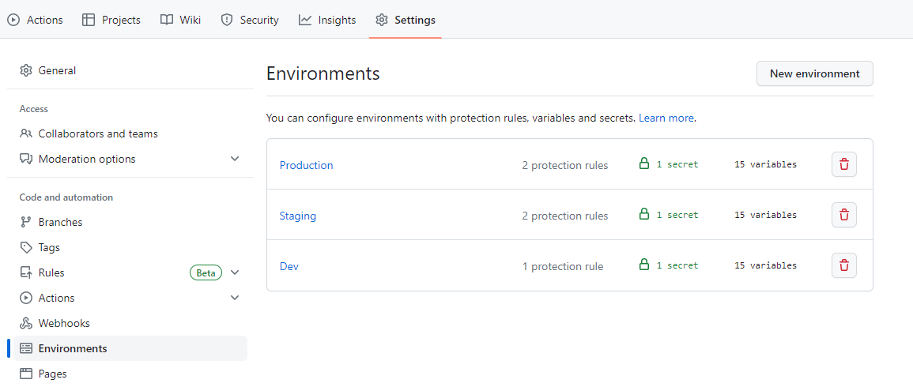
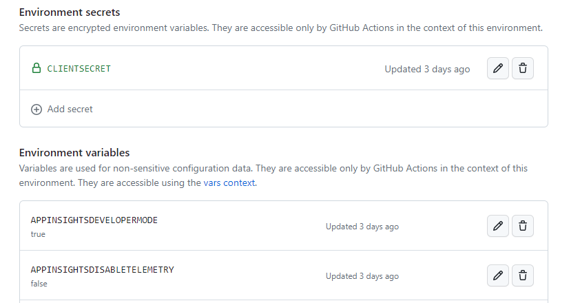

# Deploy B2C Policies using Github Actions

If you're using GitHub instead of Azure DevOps, you have the option to deploy B2C policies using [GitHub Actions](https://docs.github.com/en/actions/quickstart). Within the repository, you'll find a sample GitHub workflow located in the .github/workflows folder.

This sample workflow is configured to execute on the *'dev'* and *'main'* branches. The *'dev'* branch is deployed to the **development** environment, while the *'main'* branch is deployed to the **staging** and **production** environments.

Additionally, you'll need to create [GitHub environments](https://docs.github.com/en/actions/deployment/targeting-different-environments/using-environments-for-deployment) named **'Dev'**, **'Staging'**, and **'Production'** correspondingly. These environments are essential for providing environment-specific variables and secrets to the workflow.

## Steps to deploy B2C policies using GitHub Actions

* Ensure that your repository includes both a *'dev'* and *'main'* branch.
* Go to the repository's **'Settings'** and navigate to the **'Environment'** tab. Create the following environments:
  * Dev
  * Staging
  * Production

  
* For each environment, configure the following (these will be added in uppercase letters):
  * Variables for policy token replacement
  * Application id and secret for policy deployment (use environment secrets to store the app secret)
  
  
* Open the **'b2c-pipeline.yml'** file located in the **.github/workflows** folder. Within each job, 
  * Map the environment variables to the corresponding variables used in the policies.
  * Map the application ID, secret, and tenant information for policy deployment.

```yml
  env: # These variables are expected to be present in the GitHub environment. Edit the mappings if needed.
          PolicySet: ${{ vars.POLICYSET }}
          TenantShort: ${{ vars.TENANTSHORT }}
          TenantGuid: ${{ vars.TENANTGUID }}
          AzureIEFAppId: ${{ vars.AZUREIEFAPPID }}
          AzureProxyIEFAppId: ${{ vars.AZUREPROXYIEFAPPID }}
          ExtensionsAppId: ${{ vars.EXTENSIONSAPPID }}
          ExtensionsAppObjectId: ${{ vars.EXTENSIONSAPPOBJECTID }}
          AppInsightsInstrumentationKey: ${{ vars.APPINSIGHTSINSTRUMENTATIONKEY }}
          AppInsightsDeveloperMode: ${{ vars.APPINSIGHTSDEVELOPERMODE }}
          AppInsightsDisableTelemetry: ${{ vars.APPINSIGHTSDISABLETELEMETRY }}
          DeploymentMode: ${{ vars.DEPLOYMENTMODE }}
          ScriptExecutionElement: ${{ vars.SCRIPTEXECUTIONELEMENT }}
          UIBaseUrl: ${{ vars.UIBASEURL }}

      - name: 'Upload TrustFrameworkBase Policy'
        uses: azure-ad-b2c/deploy-trustframework-policy@v3
        with:
          folder: "Policies"
          # Specify all the policies to be deployed as comma separated. The workflow deploys the policies based on the order given here.
          files: "TrustFrameworkBase.xml,TrustFrameworkLocalization.xml,TrustFrameworkExtensions.xml,SignUpOrSignin.xml"
          tenant: ${{ vars.TENANT }}
          clientId: ${{ vars.CLIENTID }}
          clientSecret: ${{ secrets.CLIENTSECRET }}
```

